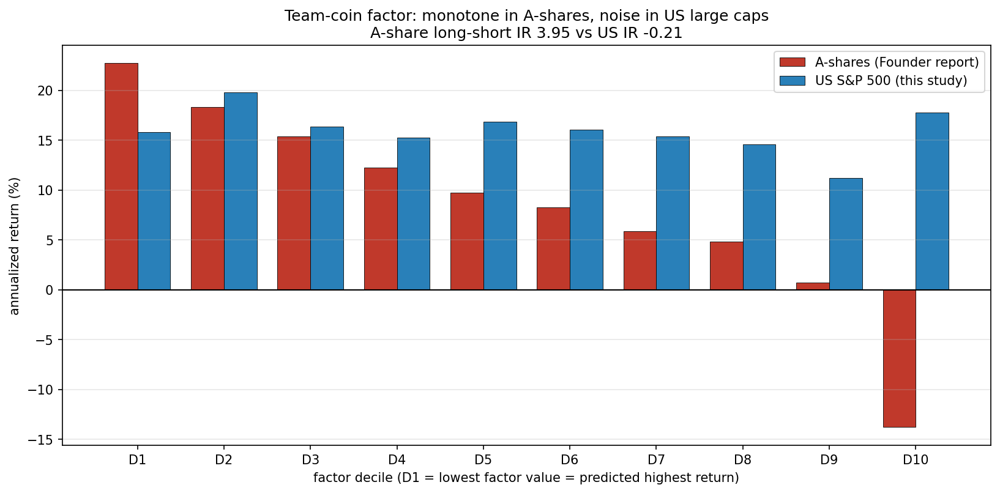
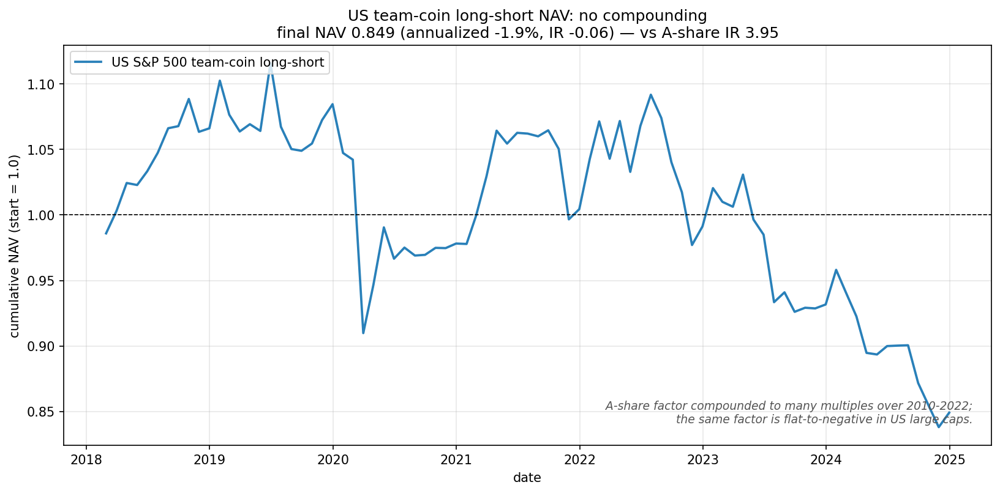
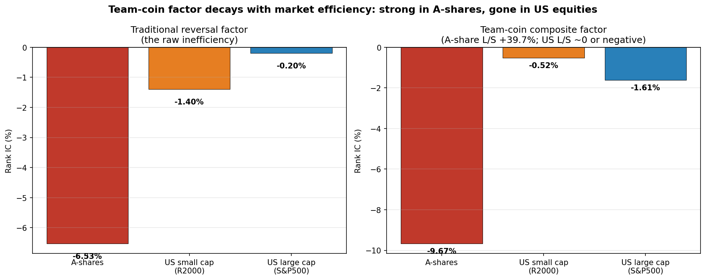
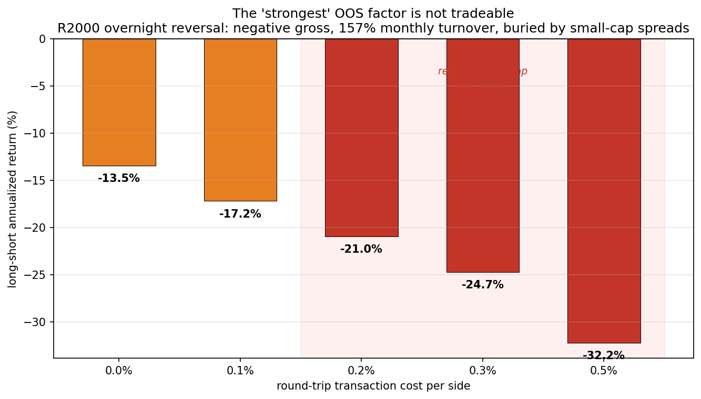

# Team-Coin Factor: From A-Shares to U.S. Equities

A replication study that ports the Founder Securities "team coin" stock-momentum
factor (方正证券《球队硬币因子》, 2022) from Chinese A-shares to U.S. large caps,
asking a single question:

> **Does this factor's alpha survive in an efficient, momentum-driven market —
> or is it a product of A-share-specific inefficiency?**

**Short answer:** it does not survive. A factor that earns **+39.69% annualized
(IR 3.95)** in A-shares is **effectively dead in the S&P 500** — Rank IC −0.016,
non-monotone deciles, long-short annualized −1.9%. The A-share alpha comes from
A-share-specific short-term reversal inefficiency, which the U.S. market has
arbitraged away.

## Background: the "team coin" idea

The original factor builds on Moskowitz (2021, *Asset Pricing and Sports
Betting*). Moskowitz observes that people treat a *coin* (high "knowability") as
mean-reverting and a *sports team* (low knowability) as momentum-driven. Applied
to stocks, investors over-react: stocks they treat as "teams" actually reverse,
stocks they treat as "coins" actually drift. The A-share report operationalizes
"knowability" with **volatility** and **turnover change** — low-volatility /
low-turnover-change stocks are "coins" (flip their reversal signal); high ones
are "teams" (keep it). It combines three return dimensions (daily, intraday,
overnight) into a single factor.

A-shares are heavily reversal-driven at short horizons, so identifying and
flipping the "coin" stocks strengthens a reversal factor dramatically.

## This study: does it work in the U.S.?

Same construction, U.S. large caps (S&P 500, 2018–2024), market-cap + sector
neutralized, monthly rebalance.

**Step 1 — there is no short-term reversal to begin with.** The traditional
reversal factor, which is −6.5% Rank IC in A-shares, is essentially zero in the
S&P 500 across all three dimensions:

| dimension | A-share Rank IC | US Rank IC | US ICIR |
|---|---|---|---|
| daily (close-close) | −6.53% | −0.34% | −0.02 |
| intraday (open-close) | −6.93% | −0.06% | −0.005 |
| overnight | +2.36% | −0.93% | −0.06 |

**Step 2 — the full team-coin factor.** Building the complete factor (vol-flip +
turnover-flip, three dimensions, neutralized):

| factor | A-share Rank IC | US Rank IC | US ICIR |
|---|---|---|---|
| traditional daily reversal | −6.53% | −0.20% | −0.02 |
| daily corrected | −8.77% | −1.46% | −0.22 |
| intraday corrected | −7.50% | −0.84% | −0.13 |
| overnight corrected | −7.55% | −0.70% | −0.13 |
| **team coin (final)** | **−9.67%** | **−1.61%** | **−0.27** |

The mechanism *replicates directionally* — flipping and combining does push the
factor more negative (daily corrected −1.46% beats the raw −0.20%), confirming
the construction is correct rather than buggy. But the magnitude is roughly
**one-sixth** of A-shares, and ICIR −0.27 is statistically indistinguishable
from noise over 83 months.

**Step 3 — no tradeable return.** A decile long-short backtest is the cleanest
verdict:



A-share deciles fall in a clean monotone staircase (+22.7% → −13.8%); U.S.
deciles are an unordered band between +11% and +20% with no gradient — decile 10
is actually *higher* than decile 1. The long-short portfolio earns **−1.9%
annualized, IR −0.21, 50.6% monthly win rate** (a coin flip):



## Findings

1. **The A-share alpha is A-share inefficiency, not a universal effect.** Short-
   term reversal — the substrate the whole factor stands on — barely exists in
   U.S. large caps. With no reversal to sharpen, the "team coin" construction has
   nothing to work with.
2. **The mechanism is real but the market is efficient.** The flip-and-combine
   logic moves the factor in the expected direction (the replication is correct),
   but the U.S. market has compressed the effect to near-noise / transaction-cost
   size.
3. **Turnover beats volatility as a knowability proxy.** Across all three
   dimensions, the turnover-change flip retains more signal than the volatility
   flip (e.g. daily −1.14% vs −0.72%) — consistent with turnover proxying
   investor disagreement.
4. **Intraday traditional reversal is slightly positive (momentum) in the U.S.**,
   opposite to the A-share −6.9% — a further sign of differing market structure
   (retail share, short-sale constraints, arbitrage capital).

## Why this matters

The contrast quantifies a market-structure difference rather than producing a
trading strategy. A factor's profitability depends on the *inefficiency it
exploits*, not the cleverness of the construction. Reporting the A-share factor's
+39.69% as if it were portable would be exactly the kind of mistake a careful
researcher avoids — the honest result is that it is arbitraged away where capital
is deep and constraints are few.

This mirrors a companion tennis project ([wimbledon-2026-forecast](https://github.com/AndyYinGL/wimbledon-2026-forecast)),
which finds that simple statistical and momentum edges are already priced into a
sharp betting market. Same conclusion from two very different markets: **market
efficiency is real, and a signal's survival depends on the inefficiency it feeds
on.**

## Extension: Russell 2000 small caps, sub-factors, and weight optimization

S&P 500 is the most-arbitraged universe on earth, so the natural question is
whether the reversal inefficiency survives in **small caps**, where liquidity is
thinner, retail share is higher, and shorting is harder. Russell 2000
constituents (iShares IWM holdings, 1,836 names downloaded) were run through the
same pipeline.

**Three markets of increasing efficiency:**



**1. The raw reversal does strengthen in small caps** — traditional reversal
Rank IC goes from −0.20% (large cap) to −1.40% daily / −2.45% overnight (small
cap, overnight ICIR −0.45). So short-term reversal inefficiency *does* persist
further down the cap spectrum.

**2. But the "team coin" flip mechanism backfires in the U.S.** Breaking the
factor into its 18 sub-components (3 return dimensions × traditional / vol-flip /
turnover-flip, both universes) shows the flip *reverses* the sign of a
genuinely-negative reversal IC — e.g. small-cap overnight turnover-flip turns
−2.45% into +2.25%. The report's flip is tuned to the A-share structure
("reversal contaminated by identifiable momentum"); U.S. small-cap reversal is
"clean," so flipping only destroys signal.

**3. No learned weighting beats the naive factor out-of-sample.** A walk-forward
test (24-month trailing window to learn weights, next-month OOS IC) compared four
combinations on small caps:

| combination (walk-forward OOS) | OOS Rank IC | ICIR |
|---|---|---|
| naive: traditional overnight reversal alone | −0.0233 | −0.42 |
| equal-weight 3 traditional (report style) | −0.0122 | −0.15 |
| rolling IR-weight (6 sub-factors) | +0.0198 | +0.30 |
| Ridge ML learned weights (6 sub-factors) | −0.0121 | −0.15 |

The simplest single factor has the strongest OOS IC; neither IR-weighting nor a
Ridge model beats it. IR-weighting actually *flips sign* by over-weighting the
counterproductive flip factors — a clean illustration of how mechanical
weight-learning chases in-sample noise.

**4. And even the "strongest" factor is not tradeable.** Built into an actual
decile long-short, the small-cap overnight reversal is **−13.5% gross**, with
157% monthly turnover; realistic small-cap spreads bury it further:



The negative IC was *diffuse* — spread across the cross-section, not concentrated
in the tails — so it never becomes a tradeable two-tail bet. This is exactly the
distinction between a statistically detectable IC and a tradeable edge.

**Answer to "what is the optimal weighting?"** Across both universes, the honest
answer is that no weighting — equal, IR, or machine-learned — produces tradeable
alpha in U.S. equities. The A-share factor's profitability is a property of
A-share inefficiency, not of the construction; in efficient markets the simplest
baseline wins and even it is not tradeable after costs.

## Method notes & honest caveats

- **Universe:** current S&P 500 constituents — survivorship bias (delisted names
  excluded). A robustness extension would use point-in-time membership.
- **Turnover proxy:** turnover = volume / shares outstanding, using a *current*
  share-count snapshot (yfinance has no historical share series). Since the factor
  compares cross-sectional ranks, the relative ordering is largely preserved, but
  this is an approximation.
- **Neutralization:** each month the factor is regressed on log(market cap) +
  sector dummies; the residual is used.
- **Period:** 2018–2024 (83 monthly rebalances). A longer history (matching the
  report's 2010–2022) is a natural extension.
- **Next step:** repeat on Russell 2000 small caps, where reversal inefficiency
  is more likely to persist (lower liquidity, higher retail share, harder to
  short).

## Reproducing

```bash
python -m venv .venv && source .venv/bin/activate
pip install yfinance pandas numpy scipy matplotlib statsmodels pyarrow lxml

PYTHONPATH=src python -m teamcoin.data           # download S&P500 daily OHLCV
PYTHONPATH=src python -m teamcoin.fundamentals   # sector / shares / market cap
PYTHONPATH=src python -m teamcoin.factors        # all factors, Rank IC table
PYTHONPATH=src python -m teamcoin.backtest       # decile long-short backtest
python notebooks/03_decile_comparison.py         # figures
python notebooks/04_nav_comparison.py
```

## Reference

- Moskowitz, T. J. (2021). *Asset Pricing and Sports Betting.* Journal of Finance.
- 方正证券 (2022). 《个股动量效应的识别及"球队硬币"因子构建》.

## License

MIT. Data from Yahoo Finance via yfinance; not redistributed.